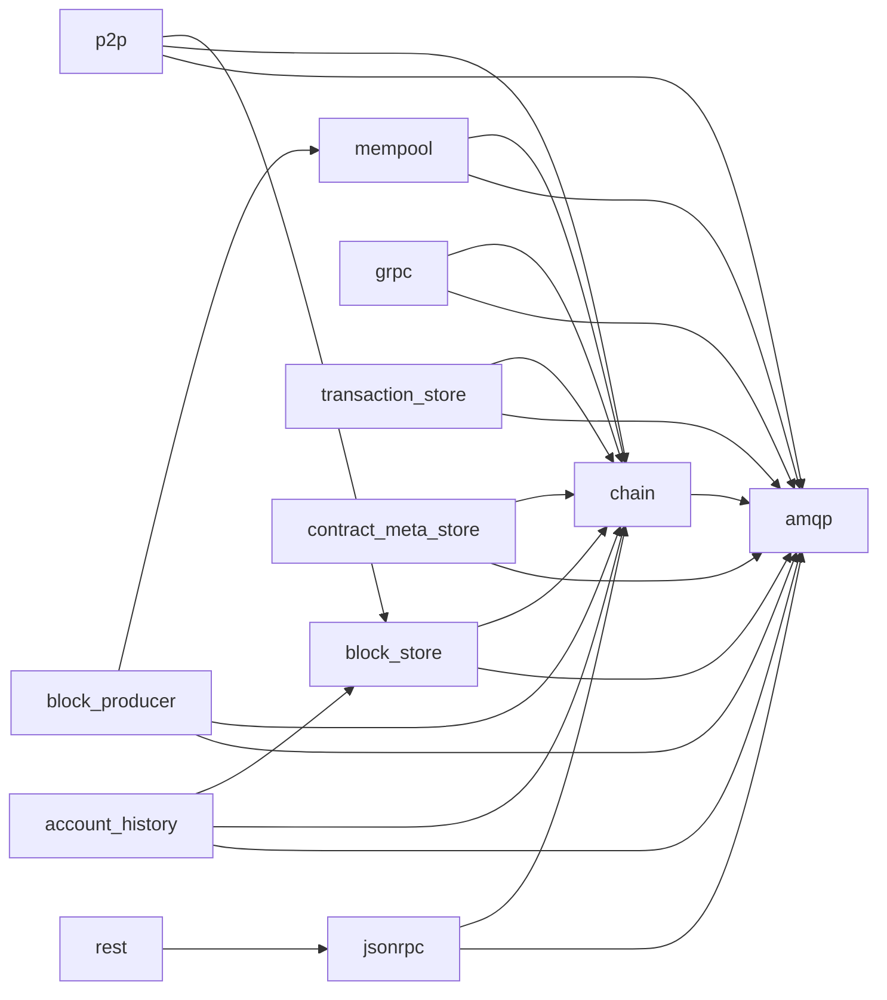

# Inventario del software base de nodos productores Koinos

Fecha: 30 de septiembre de 2026. Estado: **análisis completado; mejoras propuestas**.

## Resultado

El despliegue principal contiene **12 servicios: RabbitMQ y 11 microservicios de Koinos**. Un nodo base arranca cinco servicios; añadir producción y JSON-RPC eleva el total a siete. Las etiquetas Koinos indicadas en `env.example` existen tanto en Git como en Docker Hub. Las 11 imágenes Koinos consultadas ofrecen únicamente `linux/amd64`.

Las primeras mejoras deben abordar la identificación reproducible de las imágenes, el arranque y la salud del productor, y la actualización controlada de las herramientas de construcción. Hay además una PR abierta sobre propiedad de memoria WASM en `chain` que merece una revisión prioritaria antes de decidir una nueva versión.

## Alcance y evidencia

Se revisó el integrador [koinos/koinos](https://github.com/koinos/koinos/tree/b05b8337d0a8d09748f9c2d1faef810ee2f5de28), su rama `master` y las versiones seleccionadas por el ejemplo mainnet, junto con las ramas principales de los 11 microservicios. Se inspeccionaron manifiestos y metadatos de configuración Docker sin descargar capas ni ejecutar contenedores.

- Integrador: `b05b8337d0a8d09748f9c2d1faef810ee2f5de28`, último commit del 18 de septiembre de 2026.
- Metadatos públicos de repositorios: [upstream-metadata.json](evidence/upstream-metadata.json), con commits completos, etiquetas, releases e incidencias abiertas.
- Código de las dependencias declaradas: [source-manifests.json](evidence/source-manifests.json), [cmake-dependencies.json](evidence/cmake-dependencies.json) y [hunter-defaults.json](evidence/hunter-defaults.json).
- Imágenes y arquitecturas: [docker-registry.json](evidence/docker-registry.json), con digests completos y hora de consulta.
- Configuración del integrador: [copia de referencia](evidence/integrator/) y [hashes](evidence/integrator-files.json).

Las versiones del ejemplo representan una configuración publicada, no las versiones instaladas en un productor concreto. El código de una etiqueta y una imagen del mismo nombre son dos evidencias distintas: las imágenes Koinos inspeccionadas carecen de etiquetas OCI que acrediten su commit de origen. No se ha verificado la correspondencia exacta entre sus binarios y el código Git, ni realizado una SBOM de los binarios.

## Componentes y versiones mainnet

`CHAIN_TAG`, `P2P_TAG` y las demás variables de versión se obtienen del [env.example fijado](https://github.com/koinos/koinos/blob/b05b8337d0a8d09748f9c2d1faef810ee2f5de28/env.example). RabbitMQ está definido directamente en [docker-compose.yml](https://github.com/koinos/koinos/blob/b05b8337d0a8d09748f9c2d1faef810ee2f5de28/docker-compose.yml).

| Servicio / repositorio | Función | Versión del ejemplo | Activación | Implementación |
|---|---|---|---|---|
| `amqp` / RabbitMQ | Transporte de RPC y eventos entre servicios | `rabbitmq:3-management`, resuelve a `3.13.7` | Siempre | Erlang; imagen oficial |
| [chain](https://github.com/koinos/koinos-chain) | Validación y ejecución de bloques, estado y WASM | `v1.5.2` | Siempre | C++20 |
| [mempool](https://github.com/koinos/koinos-mempool) | Transacciones pendientes y recursos reservados | `v1.5.0` | Siempre | C++20 |
| [block_store](https://github.com/koinos/koinos-block-store) | Almacenamiento y consulta de bloques | `v1.1.0` | Siempre | Go |
| [p2p](https://github.com/koinos/koinos-p2p) | Sincronización y propagación entre pares | `v1.3.0` | Siempre | Go / libp2p |
| [block_producer](https://github.com/koinos/koinos-block-producer) | Construcción y firma de bloques; PoB configurado | `v1.3.1` | `block_producer`, `all` | C++20 |
| [jsonrpc](https://github.com/koinos/koinos-jsonrpc) | API HTTP JSON-RPC con descriptores Protobuf | `v1.2.0` | `jsonrpc`, `api`, `all` | Go |
| [grpc](https://github.com/koinos/koinos-grpc) | API gRPC | `v1.1.1` | `grpc`, `api`, `all` | C++20 |
| [transaction_store](https://github.com/koinos/koinos-transaction-store) | Historial de transacciones | `v1.1.0` | `transaction_store`, `api`, `all` | Go |
| [contract_meta_store](https://github.com/koinos/koinos-contract-meta-store) | Metadatos de contratos | `v1.1.0` | `contract_meta_store`, `api`, `all` | Go |
| [account_history](https://github.com/koinos/koinos-account-history) | Historial por cuenta | `v1.1.0` | `account_history`, `api`, `all` | C++20 |
| [rest](https://github.com/koinos/koinos-rest) | API REST y aplicación Next.js | `v1.1.1` | `rest`, `api`, `all` | Node.js / TypeScript |

El perfil `api` activa seis servicios adicionales —JSON-RPC, gRPC, REST y tres índices— y no activa producción. `all` activa los 12 servicios. Los índices y REST no son necesarios para el conjunto base de un productor. JSON-RPC resulta útil para verificarlo y operarlo, aunque no es una dependencia de producción en Compose.

### Etiqueta, release y código actual

La última release estable publicada coincide con la etiqueta del ejemplo en nueve microservicios. Dos excepciones:

- Productor: existe la etiqueta `v1.3.1` y su imagen; la última release de GitHub es `v1.3.0`. El código de `v1.3.1` declara `VERSION 1.3.0`. La [PR #156](https://github.com/koinos/koinos-block-producer/pull/156), abierta, corrige esa declaración. La macro de versión de CMake usa esa declaración para definir los números de versión.
- REST: existe la etiqueta y la imagen `v1.1.1`, pero la última release de GitHub es `v1.1.0`. `package.json` sí declara `1.1.1`.

La release del integrador `v2.2.1` fue publicada el 12 de marzo de 2025; el `master` revisado contiene cambios posteriores. La versión del integrador no representa una versión uniforme de todos los servicios.

Seis ramas principales difieren del tag seleccionado: account-history, block-store, contract-meta-store, gRPC, mempool y transaction-store. Varias diferencias son de construcción o CI. Mempool incorpora `get_pending_transactions_by_id`, ausente en el tag `v1.5.0`, y pasa de `koinos-cmake v1.0.7` a `v1.0.9`. Esto requiere decidir una publicación compatible, no sustituir automáticamente las etiquetas por `latest`. Detalle: [source-drift.json](evidence/source-drift.json).

## Dependencias de ejecución

Todos los microservicios de Koinos salvo REST se comunican por AMQP; REST llama a JSON-RPC por HTTP. Las flechas siguientes representan `depends_on` de Compose, desde el servicio hacia su dependencia, no todo el tráfico de aplicación:



El productor también consulta `p2p.get_gossip_status` y recibe `koinos.gossip.status`. Esa dependencia funcional de P2P aparece en [block_producer.cpp](https://github.com/koinos/koinos-block-producer/blob/8896d7aabbe9e0d154a5f7860920e95d17fd8cb4/src/koinos/block_production/block_producer.cpp#L69), aunque Compose no la declara directamente para el productor. El arranque base ya incluye P2P; la mejora consiste en hacer verificable su disponibilidad y el estado de gossip.

### Puertos y datos

| Interfaz publicada | Dirección predeterminada | Uso |
|---|---|---|
| AMQP `5672` | `127.0.0.1` | Broker |
| Administración `15672` | `127.0.0.1` | RabbitMQ Management |
| P2P `8888` | `0.0.0.0` | Pares externos |
| JSON-RPC `8080` | `127.0.0.1` | API HTTP |
| gRPC `50051` | `127.0.0.1` | API gRPC |
| REST `3000` | `127.0.0.1` | API REST / web |

Los servicios Koinos salvo REST montan el mismo `BASEDIR` en `/koinos`; el ejemplo usa `~/.koinos`. Las bases y logs residen en los subdirectorios utilizados por cada aplicación. La clave privada del productor se configura mediante `private-key-file`, comentado en el ejemplo. Compartir el montaje completo hace conveniente revisar posteriormente permisos y montajes por servicio.

Hay cuatro artefactos de configuración: `config.yml`, `genesis_data.json`, `koinos_descriptors.pb` y `rabbitmq.conf`. Genesis determina la identidad inicial de la cadena; los descriptores deben corresponder a las APIs servidas. Su origen y compatibilidad deberán formar parte de la validación de una actualización. RabbitMQ admite mensajes de hasta `536870912` bytes (512 MiB) en el ejemplo.

Compose declara `restart: always` en los 12 servicios. No declara `healthcheck`, límites de recursos ni opciones de rotación de logs Docker. Los `depends_on` resueltos usan `service_started`: ordenan el arranque, sin demostrar que el broker o la cadena estén disponibles para trabajar.

## Dependencias de construcción

Estas versiones describen el código de los tags seleccionados, incluyendo bibliotecas resueltas desde `koinos-cmake`. No son una identificación de los paquetes de las imágenes existentes.

### C++

Los cinco servicios C++ requieren CMake ≥ `3.19.0`, C++20 y Hunter `v0.25.5`. Sus Dockerfiles usan Alpine `3.18` como builder y `alpine:latest` como base final; instalan compiladores y paquetes mediante `apk` sin fijar sus versiones.

| Servicio | `koinos-cmake` | `koinos-proto-cpp` | `koinos-mq-cpp` | `koinos-state-db-cpp` |
|---|---|---|---|---|
| account_history `v1.1.0` | `v1.0.0` | `v1.4.0` | `v1.0.3` | `v1.1.1` |
| grpc `v1.1.1` | `v1.0.2` | `v2.0.1` | `v1.0.3` | No declarada directamente |
| mempool `v1.5.0` | `v1.0.7` | `v2.5.0` | `v1.0.3` | `v1.1.2` |
| block_producer `v1.3.1` | `v1.0.9` | `v2.6.0` | `v1.0.4` | No declarada directamente |
| chain `v1.5.2` | `v1.0.10` | `v2.6.0` | `v1.0.4` | `v1.2.1` |

Las recetas permiten sustituir las bibliotecas por submódulos `external/*` si existen. Los árboles seleccionados no contienen gitlinks; la tabla refleja las URLs de las recetas usadas por una construcción limpia.

Bibliotecas compartidas declaradas o heredadas de Hunter:

| Dependencia | Versión / revisión |
|---|---|
| Boost | `1.83.0` para Linux; Hunter usa otra versión en MinGW |
| RocksDB | `8.8.1`; declarada en chain, mempool, account_history y grpc |
| OpenSSL | `3.0.12`, predeterminado en Hunter |
| yaml-cpp | `0.6.3` |
| nlohmann_json | `3.11.2`, predeterminado en Hunter |
| gRPC | `1.31.0-p0` |
| abseil | `20230802.1` |
| re2 | `2023.03.01` |
| c-ares | `1.14.0-p0` |
| ZLIB | `1.3.0-p0` |
| Protobuf C++ | Fork Koinos, commit `e1b1477875a8b022903b548eb144f2c7bf4d9561` |
| Fizzy | `928e89736c3dc26006858619c9267a0595d6dc5d` en recetas `v1.0.0`/`v1.0.2`; `b9bf7feaa8009a3d4f4bdd49245a5cd55d122055` en `v1.0.7`/`v1.0.9`/`v1.0.10`; usada directamente por chain, mempool y account_history |
| rabbitmq-c | `b8e5f43b082c5399bf1ee723c3fd3c19cecd843e` en recetas hasta `v1.0.7`; `84b81cd97a1b5515d3d4b304796680da24c666d8` en `v1.0.9`/`v1.0.10` |
| secp256k1-vrf | Fork Koinos, commit `db479e83be5685f652a9bafefaef77246fdf3bbe` |
| log / util / exception / crypto C++ | `v2.0.1` / `v1.0.2` / `v1.0.2` / `v1.0.2` |

La versión de los esquemas, la criptografía, la ejecución WASM y la base de estado deben actualizarse con pruebas de compatibilidad y consenso. Que dos componentes utilicen versiones diferentes de las bibliotecas no demuestra por sí solo que sean incompatibles.

### Referencias de funcionamiento

Consultar la [documentación pública de arquitectura](https://github.com/koinos/koinos-docs/tree/master/docs/architecture) y el [README del coordinador](../../README.md#documentación-de-funcionamiento). La documentación general debe contrastarse con los tags y artefactos seleccionados en este inventario. Las referencias adicionales del entorno local se conservan fuera del repositorio público.

### Go

| Servicio | Directiva `go` en `go.mod` | Builder Docker | Dependencias principales |
|---|---|---|---|
| block_store | `1.15` | `golang:1.18-alpine` | Badger v3 `3.2103.2`, proto-golang/v2 `2.0.2` |
| transaction_store | `1.16` | `golang:1.18-alpine` | Badger v3 `3.2103.2`, proto-golang/v2 `2.0.2` |
| contract_meta_store | `1.16` | `golang:1.18-alpine` | Badger v3 `3.2103.2`, proto-golang/v2 `2.0.2` |
| jsonrpc | `1.15` | `golang:1.16.2-alpine` | proto-golang/v2 `2.0.2`, go-multiaddr `0.3.1`, fork protobuf-go |
| p2p | `1.21` | `golang:1.21-alpine` | proto-golang/v2 `2.4.0`, libp2p `0.30.0`, DHT `0.25.0`, pubsub `0.9.3`, multiaddr `0.11.0` |

Los cinco comparten log-golang/v2 `2.0.0`, mq-golang `1.0.1`, util-golang/v2 `2.0.1` y la dependencia declarada google.golang.org/protobuf `1.30.0`. JSON-RPC la reemplaza por el fork `github.com/koinos/protobuf-go` en `v1.27.2-0.20211016005428-adb3d63afc5e`; debe conservarse y entenderse ese comportamiento al modernizar.

Todos contienen `go.sum`. Los Dockerfiles ejecutan `go get ./...` antes de compilar y usan `alpine:latest` como base final. Conviene probar una construcción que valide módulos y evite modificar sus manifiestos; no se ha comprobado aquí si `go get` cambia efectivamente el grafo de cada servicio.

### REST

El builder y el runtime son `node:18-alpine`; la configuración de la imagen publicada declara `NODE_VERSION=18.20.8`. `package.json` declara `latest` para Next.js, React y diversas herramientas, pero existe `yarn.lock`: fija Next.js `14.2.3`, React/React DOM `18.3.1`, `@koinos/proto-js 2.1.0` y `koilib 8.1.0`. Docker ejecuta `yarn install` sin `--frozen-lockfile`. La mejora debe aprovechar y verificar el lockfile existente.

### Ciclo de soporte

- RabbitMQ `3.13`: soporte comunitario terminado el **30-09-2024**; existe soporte comercial bajo licencia. El salto a una rama con soporte requiere comprobar configuración, clientes y procedimiento de migración. Fuente: [calendario oficial RabbitMQ](https://www.rabbitmq.com/release-information).
- Alpine `3.18`: soporte regular terminado el **09-05-2025**; la página oficial indica arreglos bajo petición. Fuente: [ramas Alpine](https://alpinelinux.org/releases/).
- Node.js `18`: figura como **EOL**. Fuente: [releases Node.js](https://nodejs.org/en/about/previous-releases).
- Go `1.16`, `1.18` y `1.21`: fuera de las dos ramas mayores soportadas; la política oficial mantiene una rama hasta que aparecen dos mayores posteriores. Fuente: [política Go](https://go.dev/doc/devel/release).

Estos datos justifican una actualización de mantenimiento. No constituyen un escaneo de vulnerabilidades ni demuestran una explotación en un nodo.

## Mainnet y Harbinger

El ejemplo Harbinger selecciona versiones distintas en cuatro componentes:

| Componente | Mainnet | Harbinger |
|---|---|---|
| chain | `v1.5.2` | `v1.4.1` |
| block_producer | `v1.3.1` | `v1.3.0` |
| jsonrpc | `v1.2.0` | `v1.1.0` |
| rest | `v1.1.1` | `v0.1.0` |

Harbinger usa `~/.koinos_harbinger` y puertos de host distintos. Esta revisión incluye su configuración declarada; las cuatro imágenes antiguas no se inspeccionaron en el registro y no se ha confirmado el funcionamiento de la red. Existe la [PR #109 del integrador](https://github.com/koinos/koinos/pull/109) para documentar endpoint y faucet actuales. Una prueba en testnet debe fijar primero su configuración y versiones objetivo.

## Primeras mejoras propuestas

Todas las filas siguientes están en estado **propuesta**, salvo las PR externas enlazadas, que ya existen y estaban abiertas al consultar. Las incidencias externas son indicios para investigar; no se han reproducido sus fallos en esta revisión.

| Orden | Trabajo concreto | Repositorios | Evidencia y criterio para avanzar |
|---|---|---|---|
| 1 | Revisar y reproducir el problema de propiedad de memoria WASM | chain; Fizzy | [PR #862](https://github.com/koinos/koinos-chain/pull/862). `v1.5.2` pasa el módulo de caché a `fizzy_resolve_instantiate` y el guard lo libera. La PR propone clonar y hacer el guard no copiable. Revisar contrato de la API y reproducir con ASan; comparar suite de chain y resultados de ejecución antes de seleccionar una release. Los resultados descritos por el autor no se han ejecutado aquí. |
| 2 | Publicar un conjunto reproducible de versiones, commits y digests; evitar selección silenciosa de `latest` | integrador y publicación de los servicios | El ejemplo fija tags, Compose usa `latest` si faltan variables y las imágenes carecen de procedencia OCI. Validar configuración completa y ausente, correspondencia de artefactos y rollback. Coordinar las PR existentes del productor y las releases de REST. |
| 3 | Incorporar disponibilidad y salud verificable al arranque del productor | integrador, mq, chain, p2p, productor | Sin healthchecks; dependencia funcional de gossip. Probar arranque en frío, RabbitMQ lento/no disponible, reconexión y apagado. Medir head, LIB, avance y gossip; añadir diagnóstico de producción. |
| 4 | Modernizar y fijar builders y bases, empezando por una prueba acotada en JSON-RPC | jsonrpc, después demás Go, REST y C++ | Go antiguo, Node 18 EOL, Alpine 3.18 y bases variables. Mantener el fork Protobuf, probar conversiones JSON/Protobuf y APIs; ejecutar suites y comparación de módulos. No cambiar todas las bibliotecas a la vez. |
| 5 | Evaluar una migración de RabbitMQ con soporte y versión exacta | integrador y clientes mq | Imagen actual 3.13.7; probar tamaño de mensajes, RPC, eventos, reconexión, memoria y ruta de actualización con datos de prueba. |
| 6 | Publicar y probar imágenes ARM64 de todo el conjunto productor | 11 microservicios y bibliotecas de construcción | Todas las imágenes Koinos seleccionadas son amd64; [PR P2P #323](https://github.com/koinos/koinos-p2p/pull/323) cubre solo un componente. Requiere manifest multiarch y pruebas nativas del conjunto, especialmente C++/WASM/criptografía. |
| 7 | Añadir presupuesto de disco, logs y recuperación a la validación operativa | integrador y servicios persistentes | Montaje compartido y sin rotación Docker declarada. Medir tamaño/crecimiento, restaurar una copia de prueba y observar salud tras reinicio. Evaluar cada índice opcional por separado. |

Para una primera contribución acotada al integrador, se recomienda **el trabajo 2**: documentar y validar el conjunto de versiones y eliminar la caída silenciosa a `latest`. El trabajo 1 merece prioridad de investigación por afectar a ejecución WASM. El trabajo 3 permite después verificar que ese conjunto arranca y permanece operativo. Esta secuencia deja una referencia clara antes de modernizar dependencias.

También existen incidencias de SEGV en block-store (#138), apagado en account-history (#19) y optimización de sincronización P2P (#307 / PR #312). Están registradas en los metadatos y requieren reproducción antes de atribuir impacto a la configuración elegida.

### Correcciones pequeñas de documentación

El README del integrador no enumera gRPC ni REST entre los perfiles opcionales y omite el hecho de que `api` activa índices. `env.example` comenta `JSONRPC_PORT=8085`, mientras que el valor de Compose si no se define la variable es `8080`. Son correcciones concretas que pueden acompañar la documentación de configuración; el comentario no cambia el puerto efectivo.

## Verificación realizada y límites

- Se consultaron 12 repositorios Koinos (integrador y servicios), cinco tags de koinos-cmake y Hunter v0.25.5; se conservaron commits y manifiestos.
- `docker compose config` resolvió correctamente los conjuntos base (5), productor + JSON-RPC (7) y `all` (12), utilizando expresamente `env.example`.
- Se consultaron con éxito los 12 artefactos Docker de mainnet y se guardaron sus digests y plataformas. Ninguna descarga de capas fue necesaria.
- Las recetas y lockfiles se leyeron desde el commit de la etiqueta elegida, además de consultar las ramas actuales. Las diferencias se guardaron por separado.

La resolución Compose valida el modelo, no los archivos montados ni la disponibilidad de un nodo: el checkout de referencia mantiene `config-example`, sin crear una configuración operativa. No se ejecutaron builds, suites, benchmarks, sincronización, producción, restauraciones ni despliegues. Tampoco se consultó un productor concreto, disponibilidad de seeds o el estado de sus claves.

Los contratos de consenso, el contenido exacto de las imágenes y el grafo completo de dependencias transitivas quedan para una validación posterior. Teleno es una línea relacionada que debe compararse con este conjunto mediante su propio inventario; no se ha incorporado como servicio del despliegue legacy.

## Repetir la recogida

Desde la raíz del proyecto, con Python 3, Git, `gh` con acceso a GitHub y Docker Compose disponibles:

```bash
python3 scripts/collect_inventory.py
python3 scripts/inspect_sources.py
```

Resolver Compose en `upstream/koinos` con `--env-file env.example`, `config --format json --no-path-resolution` y los perfiles necesarios; guardar los resultados en `evidence/compose-*.json`. Después:

```bash
python3 scripts/inspect_registry.py
```

Estos scripts refrescan las evidencias con esos nombres y actualizan los checkouts de referencia solo si están limpios. Antes de repetir, archivar el directorio de evidencia si se desea conservar esta medición. Las evidencias adicionales de Hunter, koinos-cmake, diferencias y PR se recogieron durante esta revisión; deben refrescarse al cambiar los tags. La fecha de este informe permanece fija hasta una nueva revisión documentada.

## Referencias exactas de los componentes

Los SHAs son commits de código; los digests identifican artefactos Docker en el momento de consulta.

| Componente | Tag de referencia | Commit completo |
|---|---|---|
| koinos/koinos | master | `b05b8337d0a8d09748f9c2d1faef810ee2f5de28` |
| koinos/koinos-account-history | v1.1.0 | `1d592c40ddd06c022eab3153266bd428752c6ded` |
| koinos/koinos-block-producer | v1.3.1 | `8896d7aabbe9e0d154a5f7860920e95d17fd8cb4` |
| koinos/koinos-block-store | v1.1.0 | `2bb94558df61c71eb241002635444cdddce0843c` |
| koinos/koinos-chain | v1.5.2 | `0ae99eced8b585c4145424e9c2a28f667796cc66` |
| koinos/koinos-contract-meta-store | v1.1.0 | `64e803e1db1a9bb2946ae379ddad0e5611442ec5` |
| koinos/koinos-grpc | v1.1.1 | `3a94c34fa002552ef586cd1af9bfd34d175430d3` |
| koinos/koinos-jsonrpc | v1.2.0 | `2c9433c67f2f60c920525a6c4bd3e15b0b51d94a` |
| koinos/koinos-mempool | v1.5.0 | `3f2a276e4b3e4fa37c69031b2f6f707915644086` |
| koinos/koinos-p2p | v1.3.0 | `e2267ba230960b5e4100c16ad84c42cfc12eec4b` |
| koinos/koinos-rest | v1.1.1 | `d7f5bc90f11f78af9167e64913a028c00036d134` |
| koinos/koinos-transaction-store | v1.1.0 | `c8d985ab1b0dd3862fd2d0099f4458ebc6e0920c` |

### Digests Docker consultados

- `koinos/koinos-account-history:v1.1.0@sha256:170f56fc3f0dbad8302f5e7056027e32fe1c08d76129c829b62463e99e7c0182`
- `koinos/koinos-block-producer:v1.3.1@sha256:08d0c96e0b98f8c7fb2c681124ae13d4ebd3dd756abf50820531b561ffa0fa08`
- `koinos/koinos-block-store:v1.1.0@sha256:9fe2bd6730d72c95fcb785f8b5b8d549a8fa87a299a89210bd9613c0278192e1`
- `koinos/koinos-chain:v1.5.2@sha256:52bff1523b91df86f32c393bd15241cb8b4cb78cd511bbbb7f0f49c509488b7d`
- `koinos/koinos-contract-meta-store:v1.1.0@sha256:3733ece76ce2f618afeecc5f2b9b6f5022cc9d0ebf43064bed0c6698e819b70a`
- `koinos/koinos-grpc:v1.1.1@sha256:a89a8aa787eef1d7eead111d116e9668c0eb3e50c969d2d62fe8520e9dc6eee9`
- `koinos/koinos-jsonrpc:v1.2.0@sha256:73a774bbbfd0b8db3254046db74adca4f859317bd342185cc324081c73c9c9da`
- `koinos/koinos-mempool:v1.5.0@sha256:40125193b3672ed2ca5e2a4e2460f783097b4fa995b431dd54d22070c2b80cef`
- `koinos/koinos-p2p:v1.3.0@sha256:ba93bff73ab786c29f3296f854128fa9d710f9819a1227879e9deaeb5dd119ed`
- `koinos/koinos-rest:v1.1.1@sha256:3d7e30b73fbae8e48bc13195be2104ddcb250f535ceaeba5b9e4756e250d300d`
- `koinos/koinos-transaction-store:v1.1.0@sha256:48e66c3bc3dbfd5a55de5b1e5cd643fcb0387128704c8ac551f5932d6a6e837c`
- `rabbitmq:3-management@sha256:e582c0bc7766f3342496d8485efb5a1df782b5ce3886ad017e2eaae442311f69`
