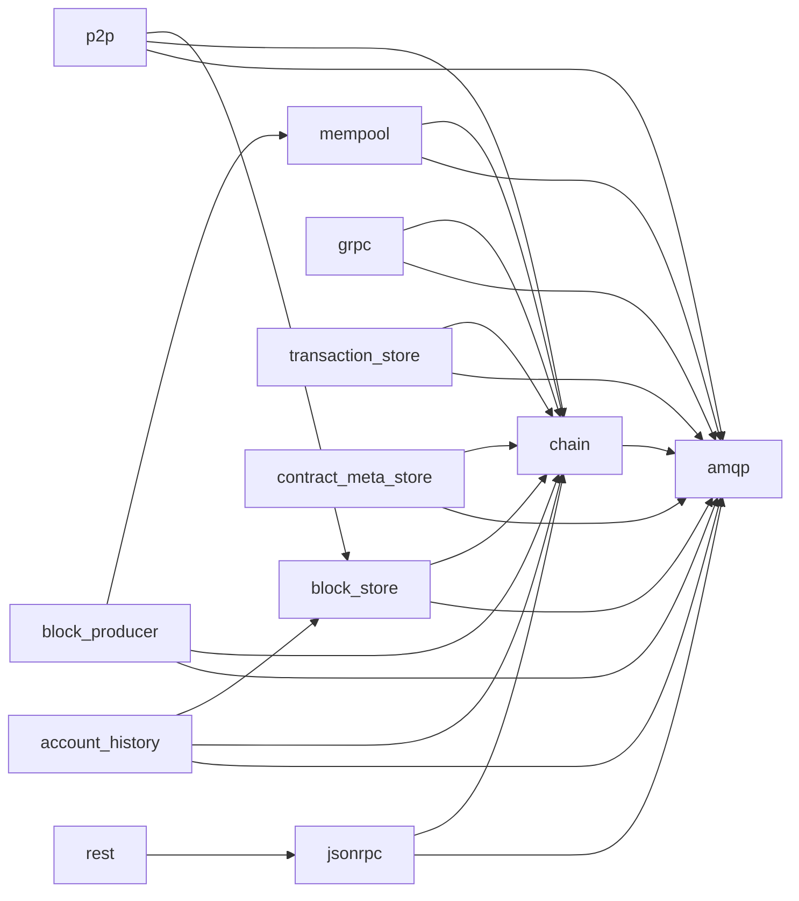

# Koinos producer node base software inventory

Date: September 30, 2026. Status: **analysis completed; improvements proposed**.

## Findings

The main deployment contains **12 services: RabbitMQ and 11 Koinos microservices**. A base node starts five services; adding production and JSON-RPC brings the total to seven. The Koinos tags listed in `env.example` exist in both Git and Docker Hub. All 11 inspected Koinos images offer only `linux/amd64`.

The first improvements should address reproducible image identification, producer startup and health, and controlled updates to build tools. There is also an open PR concerning WASM memory ownership in `chain` that deserves priority review before selecting a new version.

## Scope and evidence

The review covered the [koinos/koinos](https://github.com/koinos/koinos/tree/b05b8337d0a8d09748f9c2d1faef810ee2f5de28) integration repository, its `master` branch and the versions selected by the mainnet example, together with the default branches of the 11 microservices. Docker manifests and configuration metadata were inspected without downloading layers or running containers.

- Integration repository: `b05b8337d0a8d09748f9c2d1faef810ee2f5de28`, latest commit dated September 18, 2026.
- Public repository metadata: [upstream-metadata.json](evidence/upstream-metadata.json), with full commits, tags, releases and open issues.
- Source for declared dependencies: [source-manifests.json](evidence/source-manifests.json), [cmake-dependencies.json](evidence/cmake-dependencies.json) and [hunter-defaults.json](evidence/hunter-defaults.json).
- Images and architectures: [docker-registry.json](evidence/docker-registry.json), with full digests and query timestamps.
- Integration configuration: [reference copy](evidence/integrator/) and [hashes](evidence/integrator-files.json).

The example versions represent a published configuration, not the versions installed on a particular producer. A Git tag and a Docker image with the same name provide different evidence: the inspected Koinos images lack OCI labels establishing their source commit. The exact correspondence between their binaries and Git source has not been verified, and no binary SBOM has been produced.

## Mainnet components and versions

`CHAIN_TAG`, `P2P_TAG` and the other version variables come from the [pinned env.example](https://github.com/koinos/koinos/blob/b05b8337d0a8d09748f9c2d1faef810ee2f5de28/env.example). RabbitMQ is defined directly in [docker-compose.yml](https://github.com/koinos/koinos/blob/b05b8337d0a8d09748f9c2d1faef810ee2f5de28/docker-compose.yml).

| Service / repository | Purpose | Example version | Activation | Implementation |
|---|---|---|---|---|
| `amqp` / RabbitMQ | RPC and event transport between services | `rabbitmq:3-management`, resolves to `3.13.7` | Always | Erlang; official image |
| [chain](https://github.com/koinos/koinos-chain) | Block validation and execution, state and WASM | `v1.5.2` | Always | C++20 |
| [mempool](https://github.com/koinos/koinos-mempool) | Pending transactions and reserved resources | `v1.5.0` | Always | C++20 |
| [block_store](https://github.com/koinos/koinos-block-store) | Block storage and queries | `v1.1.0` | Always | Go |
| [p2p](https://github.com/koinos/koinos-p2p) | Peer synchronization and propagation | `v1.3.0` | Always | Go / libp2p |
| [block_producer](https://github.com/koinos/koinos-block-producer) | Block construction and signing; configured PoB | `v1.3.1` | `block_producer`, `all` | C++20 |
| [jsonrpc](https://github.com/koinos/koinos-jsonrpc) | HTTP JSON-RPC API with Protobuf descriptors | `v1.2.0` | `jsonrpc`, `api`, `all` | Go |
| [grpc](https://github.com/koinos/koinos-grpc) | gRPC API | `v1.1.1` | `grpc`, `api`, `all` | C++20 |
| [transaction_store](https://github.com/koinos/koinos-transaction-store) | Transaction history | `v1.1.0` | `transaction_store`, `api`, `all` | Go |
| [contract_meta_store](https://github.com/koinos/koinos-contract-meta-store) | Contract metadata | `v1.1.0` | `contract_meta_store`, `api`, `all` | Go |
| [account_history](https://github.com/koinos/koinos-account-history) | Account history | `v1.1.0` | `account_history`, `api`, `all` | C++20 |
| [rest](https://github.com/koinos/koinos-rest) | REST API and Next.js application | `v1.1.1` | `rest`, `api`, `all` | Node.js / TypeScript |

The `api` profile activates six additional services—JSON-RPC, gRPC, REST and three indexes—and does not activate production. `all` activates all 12 services. The indexes and REST are not required for a producer's base service set. JSON-RPC is useful for verification and operation, although Compose does not declare it as a production dependency.

### Tags, releases and current source

The latest published stable release matches the example tag in nine microservices. There are two exceptions:

- Producer: the `v1.3.1` tag and image exist; the latest GitHub release is `v1.3.0`. The source at `v1.3.1` declares `VERSION 1.3.0`. The open [PR #156](https://github.com/koinos/koinos-block-producer/pull/156) corrects this declaration. The CMake version macro uses that declaration to define the version numbers.
- REST: the `v1.1.1` tag and image exist, but the latest GitHub release is `v1.1.0`. `package.json` does declare `1.1.1`.

Integration release `v2.2.1` was published on March 12, 2025; the reviewed `master` contains later changes. The integration version does not represent a uniform version across all services.

Six default branches differ from the selected tag: account-history, block-store, contract-meta-store, gRPC, mempool and transaction-store. Several differences concern builds or CI. Mempool adds `get_pending_transactions_by_id`, which is absent from tag `v1.5.0`, and moves from `koinos-cmake v1.0.7` to `v1.0.9`. This requires selecting a compatible release rather than automatically replacing tags with `latest`. Details: [source-drift.json](evidence/source-drift.json).

## Runtime dependencies

All Koinos microservices except REST communicate through AMQP; REST calls JSON-RPC over HTTP. The following arrows represent Compose `depends_on` relationships, from each service to its dependency, rather than all application traffic:



The producer also queries `p2p.get_gossip_status` and receives `koinos.gossip.status`. This functional P2P dependency appears in [block_producer.cpp](https://github.com/koinos/koinos-block-producer/blob/8896d7aabbe9e0d154a5f7860920e95d17fd8cb4/src/koinos/block_production/block_producer.cpp#L69), although Compose does not declare it directly for the producer. Base startup already includes P2P; the improvement would make its availability and gossip status verifiable.

### Ports and data

| Published interface | Default address | Use |
|---|---|---|
| AMQP `5672` | `127.0.0.1` | Broker |
| Management `15672` | `127.0.0.1` | RabbitMQ Management |
| P2P `8888` | `0.0.0.0` | External peers |
| JSON-RPC `8080` | `127.0.0.1` | HTTP API |
| gRPC `50051` | `127.0.0.1` | gRPC API |
| REST `3000` | `127.0.0.1` | REST API / web |

All Koinos services except REST mount the same `BASEDIR` at `/koinos`; the example uses `~/.koinos`. Databases and logs reside in the subdirectories used by each application. The producer's private key is configured through `private-key-file`, which is commented out in the example. Sharing the entire mount warrants a later review of permissions and mounts for each service.

There are four configuration artifacts: `config.yml`, `genesis_data.json`, `koinos_descriptors.pb` and `rabbitmq.conf`. Genesis determines the initial chain identity; descriptors must match the served APIs. Their origin and compatibility should form part of update validation. The RabbitMQ example allows messages up to `536870912` bytes (512 MiB).

Compose declares `restart: always` for all 12 services. It declares no `healthcheck`, resource limits or Docker log rotation options. The resolved `depends_on` relationships use `service_started`: they order startup without proving that the broker or chain is ready to work.

## Build dependencies

These versions describe the source at the selected tags, including libraries resolved through `koinos-cmake`. They do not identify the packages inside the existing images.

### C++

The five C++ services require CMake ≥ `3.19.0`, C++20 and Hunter `v0.25.5`. Their Dockerfiles use Alpine `3.18` as the builder and `alpine:latest` as the final base; they install compilers and packages through `apk` without pinning package versions.

| Service | `koinos-cmake` | `koinos-proto-cpp` | `koinos-mq-cpp` | `koinos-state-db-cpp` |
|---|---|---|---|---|
| account_history `v1.1.0` | `v1.0.0` | `v1.4.0` | `v1.0.3` | `v1.1.1` |
| grpc `v1.1.1` | `v1.0.2` | `v2.0.1` | `v1.0.3` | Not declared directly |
| mempool `v1.5.0` | `v1.0.7` | `v2.5.0` | `v1.0.3` | `v1.1.2` |
| block_producer `v1.3.1` | `v1.0.9` | `v2.6.0` | `v1.0.4` | Not declared directly |
| chain `v1.5.2` | `v1.0.10` | `v2.6.0` | `v1.0.4` | `v1.2.1` |

The recipes allow libraries to be replaced by `external/*` submodules when present. The selected trees contain no gitlinks; the table reflects the recipe URLs used by a clean build.

Shared libraries declared explicitly or inherited from Hunter:

| Dependency | Version / revision |
|---|---|
| Boost | `1.83.0` for Linux; Hunter uses another version on MinGW |
| RocksDB | `8.8.1`; declared in chain, mempool, account_history and grpc |
| OpenSSL | `3.0.12`, Hunter default |
| yaml-cpp | `0.6.3` |
| nlohmann_json | `3.11.2`, Hunter default |
| gRPC | `1.31.0-p0` |
| abseil | `20230802.1` |
| re2 | `2023.03.01` |
| c-ares | `1.14.0-p0` |
| ZLIB | `1.3.0-p0` |
| Protobuf C++ | Koinos fork, commit `e1b1477875a8b022903b548eb144f2c7bf4d9561` |
| Fizzy | `928e89736c3dc26006858619c9267a0595d6dc5d` in recipes `v1.0.0`/`v1.0.2`; `b9bf7feaa8009a3d4f4bdd49245a5cd55d122055` in `v1.0.7`/`v1.0.9`/`v1.0.10`; used directly by chain, mempool and account_history |
| rabbitmq-c | `b8e5f43b082c5399bf1ee723c3fd3c19cecd843e` in recipes through `v1.0.7`; `84b81cd97a1b5515d3d4b304796680da24c666d8` in `v1.0.9`/`v1.0.10` |
| secp256k1-vrf | Koinos fork, commit `db479e83be5685f652a9bafefaef77246fdf3bbe` |
| log / util / exception / crypto C++ | `v2.0.1` / `v1.0.2` / `v1.0.2` / `v1.0.2` |

Schema versions, cryptography, WASM execution and the state database must be updated with compatibility and consensus tests. Different library versions in two components do not, by themselves, establish incompatibility.

### Service references

Consult the [public architecture documentation](https://github.com/koinos/koinos-docs/tree/master/docs/architecture) and the [coordinator README](../../README.md#service-documentation). General documentation must be checked against the tags and artifacts selected in this inventory. Additional local environment references are kept outside the public repository.

### Go

| Service | `go` directive in `go.mod` | Docker builder | Main dependencies |
|---|---|---|---|
| block_store | `1.15` | `golang:1.18-alpine` | Badger v3 `3.2103.2`, proto-golang/v2 `2.0.2` |
| transaction_store | `1.16` | `golang:1.18-alpine` | Badger v3 `3.2103.2`, proto-golang/v2 `2.0.2` |
| contract_meta_store | `1.16` | `golang:1.18-alpine` | Badger v3 `3.2103.2`, proto-golang/v2 `2.0.2` |
| jsonrpc | `1.15` | `golang:1.16.2-alpine` | proto-golang/v2 `2.0.2`, go-multiaddr `0.3.1`, protobuf-go fork |
| p2p | `1.21` | `golang:1.21-alpine` | proto-golang/v2 `2.4.0`, libp2p `0.30.0`, DHT `0.25.0`, pubsub `0.9.3`, multiaddr `0.11.0` |

All five share log-golang/v2 `2.0.0`, mq-golang `1.0.1`, util-golang/v2 `2.0.1` and the declared dependency google.golang.org/protobuf `1.30.0`. JSON-RPC replaces the latter with the `github.com/koinos/protobuf-go` fork at `v1.27.2-0.20211016005428-adb3d63afc5e`; this behavior must be preserved and understood during modernization.

All contain `go.sum`. Their Dockerfiles run `go get ./...` before compilation and use `alpine:latest` as the final base. A build that validates modules and avoids modifying their manifests should be tested; this review did not establish whether `go get` actually changes each service's dependency graph.

### REST

The builder and runtime use `node:18-alpine`; the published image configuration declares `NODE_VERSION=18.20.8`. `package.json` declares `latest` for Next.js, React and various tools, but an existing `yarn.lock` pins Next.js `14.2.3`, React/React DOM `18.3.1`, `@koinos/proto-js 2.1.0` and `koilib 8.1.0`. Docker runs `yarn install` without `--frozen-lockfile`. The improvement should use and verify the existing lockfile.

### Support lifecycle

- RabbitMQ `3.13`: community support ended on **September 30, 2024**; commercial support is available under license. Moving to a supported branch requires checking configuration, clients and migration procedures. Source: [official RabbitMQ schedule](https://www.rabbitmq.com/release-information).
- Alpine `3.18`: regular support ended on **May 9, 2025**; the official page lists fixes on request. Source: [Alpine branches](https://alpinelinux.org/releases/).
- Node.js `18`: listed as **EOL**. Source: [Node.js releases](https://nodejs.org/en/about/previous-releases).
- Go `1.16`, `1.18` and `1.21`: outside the two supported major release branches; official policy supports a branch until two later major releases appear. Source: [Go policy](https://go.dev/doc/devel/release).

These findings justify a maintenance update. They do not constitute a vulnerability scan or demonstrate exploitation on a node.

## Mainnet and Harbinger

The Harbinger example selects different versions for four components:

| Component | Mainnet | Harbinger |
|---|---|---|
| chain | `v1.5.2` | `v1.4.1` |
| block_producer | `v1.3.1` | `v1.3.0` |
| jsonrpc | `v1.2.0` | `v1.1.0` |
| rest | `v1.1.1` | `v0.1.0` |

Harbinger uses `~/.koinos_harbinger` and different host ports. This review includes its declared configuration; the four older images were not inspected in the registry and network operation has not been confirmed. [Integration PR #109](https://github.com/koinos/koinos/pull/109) documents current endpoint and faucet information. A testnet trial must first pin its target configuration and versions.

## Initial proposed improvements

All rows below have **proposal** status, except the linked external PRs, which already exist and were open at the time of inspection. External issues provide leads for investigation; their failures were not reproduced in this review.

| Order | Concrete work | Repositories | Evidence and criteria for proceeding |
|---|---|---|---|
| 1 | Review and reproduce the WASM memory ownership issue | chain; Fizzy | [PR #862](https://github.com/koinos/koinos-chain/pull/862). `v1.5.2` passes the cached module to `fizzy_resolve_instantiate` and the guard frees it. The PR proposes cloning it and making the guard non-copyable. Review the API contract and reproduce with ASan; compare the chain suite and execution results before selecting a release. The author's reported tests were not run here. |
| 2 | Publish a reproducible set of versions, commits and digests; prevent silent selection of `latest` | integration repository and service publishing | The example pins tags, Compose uses `latest` when variables are missing, and the images lack OCI provenance. Validate complete and missing configuration, artifact correspondence and rollback. Coordinate existing producer PRs and REST releases. |
| 3 | Add verifiable readiness and health to producer startup | integration repository, mq, chain, p2p, producer | No healthchecks; functional gossip dependency. Test cold startup, slow/unavailable RabbitMQ, reconnection and shutdown. Measure head, LIB, advancement and gossip; add production diagnostics. |
| 4 | Modernize and pin builders and bases, starting with a scoped JSON-RPC trial | jsonrpc, then other Go services, REST and C++ | Old Go versions, Node 18 EOL, Alpine 3.18 and floating bases. Preserve the Protobuf fork, test JSON/Protobuf conversions and APIs; run suites and module comparisons. Do not change all libraries at once. |
| 5 | Evaluate migration to a supported, exact RabbitMQ version | integration repository and mq clients | Current image 3.13.7; test message size, RPC, events, reconnection, memory and the upgrade path with test data. |
| 6 | Publish and test ARM64 images for the full producer stack | 11 microservices and build libraries | All selected Koinos images are amd64; [P2P PR #323](https://github.com/koinos/koinos-p2p/pull/323) covers only one component. Requires a multiarch manifest and native tests of the stack, especially C++/WASM/cryptography. |
| 7 | Add disk, log and recovery budgets to operational validation | integration repository and persistent services | Shared mount and no declared Docker rotation. Measure size/growth, restore a test backup and observe health after restart. Evaluate each optional index separately. |

For the first scoped contribution to the integration repository, **work item 2** is recommended: document and validate the version set and eliminate silent fallback to `latest`. Work item 1 deserves priority investigation because it affects WASM execution. Work item 3 would then verify that the selected stack starts and remains operational. This sequence establishes a clear reference before modernizing dependencies.

There are also issues concerning SEGV in block-store (#138), shutdown in account-history (#19) and P2P synchronization optimization (#307 / PR #312). They are recorded in the metadata and require reproduction before attributing an impact to the selected configuration.

### Small documentation corrections

The integration README omits gRPC and REST from the optional profiles and does not state that `api` activates indexes. `env.example` comments out `JSONRPC_PORT=8085`, whereas Compose defaults to `8080` when the variable is unset. These are concrete corrections that can accompany configuration documentation; the comment does not change the effective port.

## Verification performed and limitations

- Queried 12 Koinos repositories (integration and services), five koinos-cmake tags and Hunter v0.25.5; retained commits and manifests.
- `docker compose config` successfully resolved the base (5), producer + JSON-RPC (7) and `all` (12) service sets, explicitly using `env.example`.
- Successfully inspected all 12 mainnet Docker artifacts and saved their digests and platforms. No layer downloads were required.
- Read recipes and lockfiles from the selected tag's commit, alongside current branches. Differences were saved separately.

Compose resolution validates the model, not mounted files or node availability: the reference checkout retains `config-example` without creating an operational configuration. No builds, suites, benchmarks, synchronization, production, restores or deployments were run. No particular producer, seed availability or key state was inspected either.

Consensus contracts, exact image contents and the complete transitive dependency graph remain for later validation. Teleno is a related development line that should be compared with this stack through its own inventory; it has not been included as a service in the legacy deployment.

## Repeat evidence collection

From the project root, with Python 3, Git, `gh` with GitHub access and Docker Compose available:

```bash
python3 scripts/collect_inventory.py
python3 scripts/inspect_sources.py
```

Resolve Compose in `upstream/koinos` with `--env-file env.example`, `config --format json --no-path-resolution` and the required profiles; save results to `evidence/compose-*.json`. Then:

```bash
python3 scripts/inspect_registry.py
```

These scripts refresh the evidence files under the same names and update reference checkouts only when clean. Archive the evidence directory before repeating if this measurement should be retained. Additional Hunter, koinos-cmake, drift and PR evidence was collected during this review; refresh it when changing tags. This report's date remains fixed until a newly documented review.

## Exact component references

SHAs identify source commits; digests identify Docker artifacts at the time of inspection.

| Component | Reference tag | Full commit |
|---|---|---|
| koinos/koinos | master | `b05b8337d0a8d09748f9c2d1faef810ee2f5de28` |
| koinos/koinos-account-history | v1.1.0 | `1d592c40ddd06c022eab3153266bd428752c6ded` |
| koinos/koinos-block-producer | v1.3.1 | `8896d7aabbe9e0d154a5f7860920e95d17fd8cb4` |
| koinos/koinos-block-store | v1.1.0 | `2bb94558df61c71eb241002635444cdddce0843c` |
| koinos/koinos-chain | v1.5.2 | `0ae99eced8b585c4145424e9c2a28f667796cc66` |
| koinos/koinos-contract-meta-store | v1.1.0 | `64e803e1db1a9bb2946ae379ddad0e5611442ec5` |
| koinos/koinos-grpc | v1.1.1 | `3a94c34fa002552ef586cd1af9bfd34d175430d3` |
| koinos/koinos-jsonrpc | v1.2.0 | `2c9433c67f2f60c920525a6c4bd3e15b0b51d94a` |
| koinos/koinos-mempool | v1.5.0 | `3f2a276e4b3e4fa37c69031b2f6f707915644086` |
| koinos/koinos-p2p | v1.3.0 | `e2267ba230960b5e4100c16ad84c42cfc12eec4b` |
| koinos/koinos-rest | v1.1.1 | `d7f5bc90f11f78af9167e64913a028c00036d134` |
| koinos/koinos-transaction-store | v1.1.0 | `c8d985ab1b0dd3862fd2d0099f4458ebc6e0920c` |

### Inspected Docker digests

- `koinos/koinos-account-history:v1.1.0@sha256:170f56fc3f0dbad8302f5e7056027e32fe1c08d76129c829b62463e99e7c0182`
- `koinos/koinos-block-producer:v1.3.1@sha256:08d0c96e0b98f8c7fb2c681124ae13d4ebd3dd756abf50820531b561ffa0fa08`
- `koinos/koinos-block-store:v1.1.0@sha256:9fe2bd6730d72c95fcb785f8b5b8d549a8fa87a299a89210bd9613c0278192e1`
- `koinos/koinos-chain:v1.5.2@sha256:52bff1523b91df86f32c393bd15241cb8b4cb78cd511bbbb7f0f49c509488b7d`
- `koinos/koinos-contract-meta-store:v1.1.0@sha256:3733ece76ce2f618afeecc5f2b9b6f5022cc9d0ebf43064bed0c6698e819b70a`
- `koinos/koinos-grpc:v1.1.1@sha256:a89a8aa787eef1d7eead111d116e9668c0eb3e50c969d2d62fe8520e9dc6eee9`
- `koinos/koinos-jsonrpc:v1.2.0@sha256:73a774bbbfd0b8db3254046db74adca4f859317bd342185cc324081c73c9c9da`
- `koinos/koinos-mempool:v1.5.0@sha256:40125193b3672ed2ca5e2a4e2460f783097b4fa995b431dd54d22070c2b80cef`
- `koinos/koinos-p2p:v1.3.0@sha256:ba93bff73ab786c29f3296f854128fa9d710f9819a1227879e9deaeb5dd119ed`
- `koinos/koinos-rest:v1.1.1@sha256:3d7e30b73fbae8e48bc13195be2104ddcb250f535ceaeba5b9e4756e250d300d`
- `koinos/koinos-transaction-store:v1.1.0@sha256:48e66c3bc3dbfd5a55de5b1e5cd643fcb0387128704c8ac551f5932d6a6e837c`
- `rabbitmq:3-management@sha256:e582c0bc7766f3342496d8485efb5a1df782b5ce3886ad017e2eaae442311f69`
